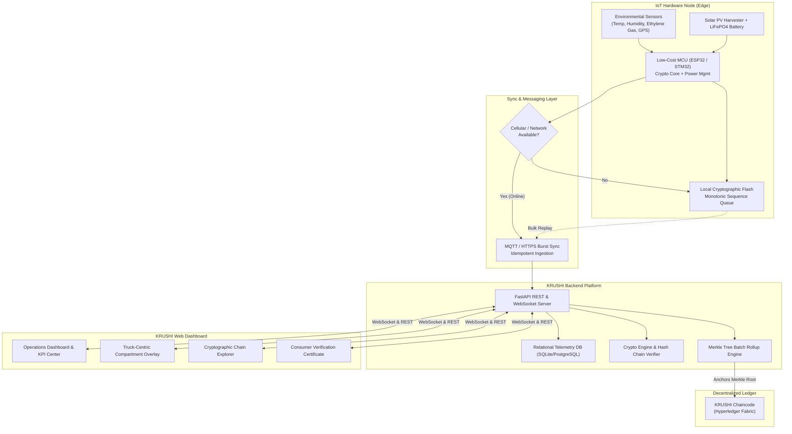

# KRUSHI — कृषि (SIH26232)
### **Offline-First IoT & Blockchain-Enabled Farm-to-Fork Traceability**
*Smart India Hackathon 2024 / 2026 — Problem Statement 26232*  
*Ministry of Food Processing Industries (MoFPI) | Hardware & Software Track*

---

## 📌 Executive Summary

**KRUSHI (कृषि)** is an end-to-end, rugged, affordable, and offline-first cold-chain traceability platform engineered specifically for agricultural supply chains in India. Standard cold-chain loggers lose connectivity across remote rural routes, creating critical telemetry blind spots. Furthermore, conventional enterprise solutions are prohibitively expensive for smallholder farmers and agricultural SMEs.

KRUSHI solves this by combining:
1. **Low-Cost Rugged IoT Sensor Nodes** with local cryptographic flash storage and solar energy harvesting.
2. **Offline-First Local Queuing & Monotonic Chaining**, ensuring zero data loss during rural transit blind spots.
3. **SHA-256 Hash Chaining & Instant Tamper Detection**, mathematically guaranteeing data integrity from the physical node.
4. **Decentralized Ledger Anchoring (Merkle Trees)**, aggregating sensor batches onto a Hyperledger Fabric permissioned ledger without public gas costs.
5. **Truck-Centric Multi-Compartment Visualization & Consumer QR Provenance**, providing clear operational views for logistics operators and trustworthy verification for consumers.

---

## 🌟 Key Features

| Capability | Technical Implementation | Value to Supply Chain |
| :--- | :--- | :--- |
| **Offline-First Telemetry** | Local non-volatile circular queue + monotonic sequence counter (Seqᵢ = Seqᵢ₋₁ + 1) | Zero data loss in remote rural areas with intermittent 2G/4G connectivity. |
| **Tamper-Evident Hash Chain** | Canonical JSON + SHA-256 pointer chain (Hᵢ = SHA-256(..., Hᵢ₋₁)) | Prevents driver or database manipulation; detect unauthorized alterations immediately. |
| **Decentralized Ledger Proofs** | Batch Merkle Tree aggregation anchored to Hyperledger Fabric chaincode | Scalable verification with verifiable block numbers and transaction hashes. |
| **Environmental Monitoring** | Temperature, relative humidity, and ethylene gas (C₂H₄) | Detects spoilage, chilling injury, and premature fruit ripening in transit. |
| **Physical Compartment Mapping** | Multi-cell truck overlay UI mapping physical reefer zones | Isolates thermal excursions to specific cargo sections (e.g. forward vs. rear compartment). |
| **Consumer QR Provenance** | Instant mobile-friendly GI-tag and cold-chain compliance certificate | Empowers retailers and buyers to verify freshness and farm origin with 1 scan. |
| **Solar Energy Harvesting** | Dynamic battery monitoring + photovoltaic power management circuit | Extends autonomous node lifespan across long-haul multi-state transit routes. |

---

## 📸 Application Screenshots & UI Showcase

<p align="center">
  
</p>

### 1. Operations & Monitoring Views
| 🚛 Multi-Compartment Reefer Telemetry | 🌾 Kisan & Supply Chain Overview |
| :---: | :---: |
|  |  |
| *Real-time temperature, humidity, ripening ethylene (C₂H₄) & truck compartment mapping* | *Active transit corridors, GPS coordinates, blindspot sync health, and active fleets* |

### 2. Cryptographic Provenance & Verification
| 🔗 Tamper-Proof Audit & Blockchain Proofs | 📱 Consumer Transparency QR Certificate |
| :---: | :---: |
|  |  |
| *SHA-256 hash chaining, Merkle tree root rollup, and Hyperledger Fabric chaincode anchor* | *Instant smartphone QR scan for GI-tag compliance and farm-to-fork origin certificate* |

### 3. Excursions & Analytics
| 🚨 Real-Time Spoilage & Excursion Alerts | 📊 Freshness & Quality Compliance Analytics |
| :---: | :---: |
|  |  |
| *Critical temperature excursion spikes, ethylene gas alerts, and offline heartbeat tracking* | *Transit compliance scorecards, shipment distribution, and delivery performance metrics* |

---


## 🏛 System Architecture



---

## 🔐 Blockchain & Cryptographic Integrity Architecture

KRUSHI employs a **3-tier hybrid architecture** to solve the fundamental blockchain dilemma: recording tens of thousands of continuous IoT readings directly on-chain creates storage bloat and latency, while storing them purely in a centralized database lacks verifiable trust.

### 3-Tier Integrity Pipeline

| Tier | Component | Mechanism | Cryptographic Guarantee |
| :--- | :--- | :--- | :--- |
| **Tier 1: Physical Edge** | IoT Node (ESP32) | Deterministic canonical serialization + recursive SHA-256 hash chaining | Mathematical proof that no sensor reading was altered since capture |
| **Tier 2: Batch Rollup** | Merkle Rollup Engine | Batches 50–100 sequential readings into a binary Merkle Tree | Compresses thousands of readings into a single 32-byte Merkle Root |
| **Tier 3: Consortium Ledger** | Hyperledger Fabric | Smart contract (`agritrace_cc`) commits Merkle Root to `agrichannel` | Immutable multi-party endorsement (APEDA Gov + Farmer Co-op + Logistics) |

### Merkle Tree Ledger Anchoring

```
                 [Merkle Root]  ← Anchored to Hyperledger Fabric ('agrichannel')
                  /          \
          [Hash(1,2)]    [Hash(3,4)]
           /      \        /      \
        [H₁]    [H₂]   [H₃]    [H₄]  ← Individual SHA-256 Sensor Reading Hashes
```

* **Instant Tamper Detection**: If any record is modified in the database, recomputing the chain immediately flags:
  `SHA-256(Recordᵢ) ≠ Hᵢ` or `Hᵢ ≠ PreviousHash(i+1)`, pinpointing the exact corrupted record sequence.
* **Efficient Inclusion Proofs ($O(\log N)$)**: A buyer scanning a QR code can cryptographically verify that their specific carton's temperature history belongs to the on-chain Merkle Root using just a compact sibling audit path—without needing to download the entire database.

---

## 📁 Repository Structure

```
SIH232/
├── backend/
│   ├── crypto_engine.py      # SHA-256 hash chaining, ECDSA verification & Merkle tree logic
│   ├── main.py               # FastAPI server, 30+ REST routes, WebSocket broadcaster
│   ├── models.py             # SQLAlchemy models (Device, Shipment, Telemetry, Alert, LedgerAnchor)
│   ├── requirements.txt      # Backend Python dependencies
│   ├── seed_data.py          # Real-world Indian agricultural routes & telemetry seed
│   ├── simulator.py          # IoT simulator (offline queue, burst sync, tamper injection)
│   └── supabase_sync.py      # Cloud sync to Supabase PostgreSQL
├── blockchain/
│   ├── chaincode/
│   │   └── agritrace_anchor.go  # Hyperledger Fabric chaincode (Go)
│   ├── security/
│   │   ├── supabase_hardened_rls.sql  # Row-Level Security policies
│   │   └── supabase_setup_quickstart.sql
│   └── README.md             # Fabric consortium topology & endorsement policy
├── iot-device/
│   ├── KRUSHI_ESP32_SINGLE.ino  # Primary ESP32 production firmware
│   ├── config.h              # Hardware configuration & TLS certificates
│   ├── cloud_manager.h/.cpp  # HTTPS transmission & retry logic
│   ├── network_manager.h     # WiFi/4G LTE connectivity management
│   ├── storage_manager.h     # Non-volatile flash queue (offline-first)
│   └── diagnostics.h         # System health & battery monitoring
├── frontend/
│   └── src/
│       ├── App.tsx           # Main application shell with WebSocket listener
│       ├── services/api.ts   # REST/WebSocket client
│       ├── types/index.ts    # TypeScript interfaces
│       └── components/       # 14 modular view components
│           ├── DashboardView/     # Fleet overview, KPIs & simulation controls
│           ├── MonitoringView/    # Real-time sensor charts
│           ├── TruckOverlay/      # Reefer compartment visualizer
│           ├── TraceabilityView/  # Blockchain ledger & hash chain explorer
│           ├── ConsumerVerifyView/ # Public QR verification certificate
│           ├── AlertsView/        # Excursion management
│           ├── AnalyticsView/     # Compliance scorecards
│           ├── ShipmentsView/     # Manifest & route tracking
│           └── ...                # + Navbar, Sidebar, AuthModal, etc.
├── docs/                     # Architecture guide, security roadmap, specs
├── tests/                    # Automated pytest suite (17 tests)
├── scripts/                  # Utility scripts (reset, upload)
├── screenshots/              # Dashboard & UI captures
├── start.py                  # Single-command concurrent launcher
├── start.bat                 # Windows one-click start script
└── README.md
```

---

## 🚀 Quickstart & Running Locally

### Prerequisites
* **Python 3.10+** (with `pip`)
* **Node.js 18+** (with `npm`)
* **Git**

### 1. Clone the Repository
```bash
git clone https://github.com/PranavXDragon/Krushi.git
cd Krushi
```

### 2. Single-Command Launch (Recommended)
Start both the FastAPI backend and React frontend concurrently with one command:

```bash
python start.py
```
*(On Windows, you can also double-click `start.bat`)*

The launcher automatically checks dependencies, boots the FastAPI server (`:8000`), starts Vite (`:5173`), and opens the dashboard in your default browser.

* 📱 **Web Dashboard**: `http://localhost:5173/`
* 🚀 **Backend REST API**: `http://127.0.0.1:8000`
* 📖 **Interactive Swagger Docs**: `http://127.0.0.1:8000/docs`
* ⚡ **WebSocket Stream**: `ws://localhost:8000/ws/telemetry`

---

<details>
<summary><b>Manual Launch (Separate Terminals)</b></summary>

#### Step A: Start Backend API
```bash
cd backend
python -m pip install -r requirements.txt
python -m uvicorn main:app --host 127.0.0.1 --port 8000 --reload
```

#### Step B: Start Frontend Dashboard
```bash
cd frontend
npm install
npm run dev
```

</details>

---

## 🌾 Real-World Deployment & Demonstration Guide

The platform is pre-loaded with an authentic export shipment dataset modelled on the high-value **Ratnagiri to Mumbai Cold Export Corridor** (NH-66), featuring active ESP32 edge telemetry and Hyperledger Fabric verification:

### 📋 Live Shipment & Hardware Profile

| Parameter | Deployed Value | Specification & Standard |
| :--- | :--- | :--- |
| **Cargo & Variety** | Ratnagiri Alphonso Mangoes (GI Tag #42) | Export grade, pre-cooled to 3.8°C |
| **Transit Corridor** | NH-66 Coastal Highway (345 km) | Ratnagiri Orchards → Chiplun Hub → Khed Pass → JNPT Port |
| **Edge Hardware** | ESP32-S3 Cold-Chain Logger (`KRUSHI-NODE-001`) | Hardware SECP256k1 keypair, TLS 1.3 pinning, SPIFFS flash |
| **Power Architecture** | 94.5% LiFePO4 (Solar 320mW Harvesting) | Autonomous operation for up to 14 days without truck auxiliary power |
| **Monitored Metrics** | Temp: **3.8°C** · RH: **78.0%** · Ethylene: **12.4 ppm** | APEDA export threshold: Temp < 8.0°C, Ethylene < 50.0 ppm |
| **Blockchain Network** | Hyperledger Fabric v2.5 (`agrichannel`) | Endorsed by ApedaGovMSP + FarmerCoopMSP + LogisticsMSP |

---

### 🧪 Live Hardware & Edge Evaluation Walkthrough

The Operations Dashboard includes an **Edge Testbench & Hardware Controls** bar specifically designed to demonstrate how KRUSHI handles real-world edge conditions:

1. **Rural Connectivity Blackout & Edge Flash Queuing**:
   * Click **`Simulate Offline`** in the control bar to simulate entering a cellular blindspot (e.g. Khed mountain pass). The node switches to `Offline Queue`.
   * Click **`Emit Reading`** multiple times. Telemetry records continue to be signed locally and buffered into non-volatile edge flash with strictly monotonic sequence numbers ($Seq_i$).
2. **Cellular Restoration & Idempotent Burst Sync**:
   * Click **`Restore Online`**.
   * Click **`Burst Sync (N)`**. All buffered records are ingested via MQTT/HTTPS in an idempotent burst, updating telemetry charts in real time with **zero data loss**.
3. **Food Safety Threshold Breaches & Zone Isolation**:
   * Click **`Temp Spike`** (33.5°C reefer failure) or **`Gas Spike`** (64.8 ppm ripening surge).
   * An immediate **CRITICAL** alert is dispatched, the truck compartment visualizer isolates the affected zone in red, and the incident logs to the immutable audit timeline.
4. **Cryptographic Tamper Detection & Proof Auditing**:
   * Click **`Corrupt Hash`**. This injects a single-byte mutation into a historical database record.
   * Switch to the **Traceability** tab and click **`Audit Proof Chain`**. The mathematical engine flags **`SEQUENCE TAMPER DETECTED`**, pinpointing the exact corrupted block sequence and preventing falsified compliance reports.
5. **Decentralized Hyperledger Fabric Anchoring**:
   * Click **`Anchor Proof`** in the control bar. The system rolls up the latest verified readings into a binary **Merkle Tree**, computes the 32-byte root, and commits an immutable transaction anchor on the Hyperledger Fabric ledger (`agrichannel`).
6. **Consumer GI-Tag & Freshness QR Verification**:
   * On the **Traceability** tab, click **`Generate Consumer QR`** (or open the **Consumer Verify** tab).
   * Evaluators can scan the QR code with any smartphone to inspect the live farm-to-fork origin certificate, APEDA compliance scorecard, and verifiable handover log.

---

## 👥 Problem Statement Details
* **Problem Statement ID**: SIH26232
* **Ministry**: Ministry of Food Processing Industries (MoFPI)
* **Theme**: Agriculture, FoodTech & Rural Development
* **Hardware Category**: Rugged IoT Node & Cold-Chain Farm-to-Fork Platform

---

## 📜 License
Developed for Smart India Hackathon. Released under the MIT License.
